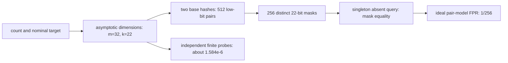
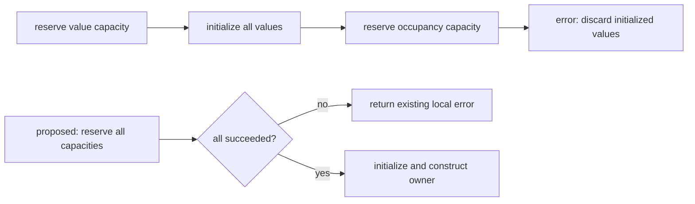

# Fresh adversarial repository review — 2026-10-02

Reviewed `/home/aifu/projects/eloraiby/sketches` on branch
`refactor/remove-redundant-lsh-metadata`, HEAD
`c792fd28d2eaf637c53521668543740ba748e192`.
This covers the current working tree and the complete available history of its
major boundaries, rather than only the latest changes. The tracked working tree
was clean. The previously untracked adversarial report was deleted at the user's
request before this investigation; this document replaces it with fresh evidence.
Finding IDs below belong to this review.

## Implementation status — 2026-10-02

The user subsequently authorized all four repairs through `implement-fix`.
This table records their implementation status. The review evidence, source
line references and final-state appendix below describe the original
`c792fd28d2eaf637c53521668543740ba748e192` snapshot, not the repaired revision.

| ID | Status | Result and fresh verification |
| --- | --- | --- |
| F1 | Addressed | Module, constructor, sizing helpers and README explicitly describe asymptotic sizing and finite probe correlation. Four new regressions exhaust all 512 `(32,22)` base-hash pairs, check an independent-probe control against 16 exhaustive small cases and exact reference values, bridge the model to production, and exercise 608,000 absent queries plus merge/clear/reuse over two identified key distributions. All 19 Bloom tests pass. Production dimensions/probes and the advisory contract remain unchanged; no finite target guarantee is added. |
| D1 | Addressed | The private-helper reference is plain inline code. Public rustdoc passes with `rustdoc::private_intra_doc_links` denied; the rendered MinHash page retains the persistence/version caveat. The helper remains crate-private and hashing is unchanged. |
| S1 | Addressed | MinMax reserves values, occupancy and row seeds before value initialization, preserving layouts, error categories and seeded behavior. Four new public allocation regressions cover 100 denied reservation boundaries across 20 shapes each for allocated/ZST values, successful reuse/merge/clear, invalid layouts, and a maximum-sized ZST table. The ordering regressions fail on the old code; 15 MinMax unit tests and all 10 reservation tests pass, and all four MinMax reservation regressions also pass optimized. This promises local reservation ordering, not arbitrary callback-panic rollback or universal OOM recovery. |
| S2 | Addressed | One documented crate-private `SeedStream` replaces all three copies and their duplicate increments. Domains, row algorithms, u128 high/low order and caller-owned lifetimes remain unchanged; MinHash and streaming RNG schedules are separate. Five new regressions pin literal words/wrapping, interleaved draw order, independent ownership, row coefficients and fingerprint keys captured before consolidation. Before/after family output and 19,200 public query rows over 60 seeded configurations match byte for byte, including direct-ID updates, merge, clear and reuse. No speed or binary-size improvement is claimed. |

Fresh combined implementation verification: `cargo test --locked --offline`
passes **292 unit, 25 integration and 22 doctests (339 total)**. All five new
seed/family regressions and four MinMax reservation regressions pass optimized
(nine selected release tests, not a complete release suite). All 13 README
Rust snippets and the three shared-stream consumer examples pass; the Bloom
example passed with F1. Native Clippy passes across all targets/features with
warnings denied, public rustdoc passes with all warnings denied, and formatting
and whitespace checks pass. wasm32 compilation across all targets/features
passes; the pre-existing test-only `max_standard_error` unused import remains.
Evidence is outside Cargo targets at `/tmp/sketches-fix-review-20261002/`.
Each implementation commit is preceded and followed by `cargo clean`.

The original review starts below. Its statement that no source changes were
made applies to the review invocation only; the later implementation is recorded
above and in Git commits.

Three new reviewers worked from fresh contexts on separate bounded assignments.
The parent checked their claims against current source/history, independently
reproduced the consequential Bloom result and the MinMax reservation-order result,
and reconciled competing interpretations. Reviewers did not recursively delegate.
The applicable [adversarial-review skill](../.agents/skills/adversarial-review/SKILL.md)
requires that independence. No applicable `AGENTS.md` was found. Source, existing
tests, dependencies, branches and commits were not changed. This is a review,
not authorization to implement its recommendations.

## Coverage map

The repository has one Rust library package, 15 public modules, 14 examples,
five executable benchmarks, four integration-test files, one Python reference
generator and its CSV, README, and two repository skills. Its only external Rust
dependency is the locked `siphasher` crate. There are no workspace subpackages,
IDL/COM boundaries, persistence services, network plugins or checked-in CI
workflows to trace. `CODEBASE-AUDIT.md` is an ignored historical draft and was
not treated as a normative contract.

| Boundary | Source and consumers inspected | Fresh verification / limits |
| --- | --- | --- |
| Shared ownership, hashing, errors | [lib.rs](../src/lib.rs#L49), [jaccard.rs](../src/jaccard.rs#L26), Cargo manifest/lock | Module exports, finite-relation guard, trait delegation, seed/mixer ownership; native and wasm32 compilation |
| Nonnegative and signed frequencies | [Count-Min](../src/count_min_sketch.rs#L26), [Count Sketch](../src/count_sketch.rs#L26), examples and Count-Min benchmark | Shape/sizing, fingerprint/row families, saturation versus checked linear updates, query/merge/clear, history including renamed MinCount |
| Ordered-value compression | [MinMax](../src/minmax_sketch.rs#L26), example and tests | Ordering, occupied bits, unknown-key semantics, merge algebra, generic layouts, scoped reservation-failure reproduction |
| Similarity and candidate search | [MinHash](../src/minhash.rs#L25), [LSH index](../src/minhash_lsh_index.rs#L23), examples, benchmark, both LSH integration suites and reference generator | Strict reported error sizing, owned families/signatures, lawful collision chains, replacement/removal/reuse/clone, candidate-only ranking, model tails; checked-in references exercised, generator inspected rather than regenerated |
| Heavy hitters | [Space-Saving](../src/space_saving.rs#L23), example/benchmark, stream-oracle and reservation tests | Stream-Summary transitions, ownership, combine/prune/rebuild, bounds, saturation, donor immutability, capacity-sized reconstruction |
| Membership | [Bloom](../src/bloom_filter.rs#L23), [Cuckoo](../src/cuckoo_filter.rs#L23), examples and reservation tests | Constructors, storage, insertion/query/merge/clear; new Bloom finite-model controls; 275,000 Cuckoo lifecycle transitions |
| Cardinality and set relations | [HLL](../src/hyperloglog.rs#L23), [ULL](../src/ultraloglog.rs#L23), examples and shared Jaccard consumers | Import validity, estimator boundaries, reduction/merge, saturation and error precedence; 59,536 valid ULL pair states and 36 targeted precision reductions |
| Vector moments | [VectorWelford](../src/vector_welford.rs#L26), example and inline references | Dimension/finite-input/count validation, old-deviation symmetry, merge, finite diagonal nonnegativity, materialized queries and documented extreme limits |
| Quantiles | [KLL](../src/kll.rs#L23), [t-digest](../src/tdigest.rs#L23), examples and both benchmarks | Counts, capacities, scheduling, RNG ownership, scalar/batch validation, exact mass, finite interpolation; 10,000 large-count digest mixtures and 300 terminal-boundary probes |
| Sampling | [Reservoir](../src/reservoir_sampling.rs#L23), example and reservation tests | Actual generic layout, rejection preimages, explicit seeds, count overflow, iterator prefix, clear/drop ownership |
| Build and documentation | [README](../README.md), examples, benchmarks, reference generator, skill metadata | 326 native tests, 13 README Rust snippets and all 14 examples passed; all-target Clippy/format/docs/wasm checking; benchmarks compiled, throughput not remeasured |

Whole-repository coverage means these boundaries were investigated; it is not
an exhaustive proof over every stream, floating input, generic trait, allocation
failure or supported platform.

## Settled constraints

Current normative documentation and the user's decisions in this session are
authoritative. Historical suggestions and reviewer preferences are not new
requirements.

- Ordinary floating rounding is allowed. Exact real arithmetic, mathematically
  minimal sizing and universal positive semidefiniteness are not promised.
  VectorWelford's symmetric correction and explicit extreme-input limitation
  remain the chosen contract; its name stays unchanged.
- MinHash error construction must satisfy its own reported worst-case-error
  accessor without a tolerance. Its ideal independent-component model does not
  make every realized signature exact. LSH ranks only its candidates, owns each
  canonical ID once and copies the signature needed for removal/reranking.
- KLL nonempty quantile requests intentionally fail above the inclusive `2^52`
  boundary; ingestion/merging still support exact `u64` counts. Owned RNG state
  and deterministic convenience defaults remain deliberate. Independently
  populated shards receive seeds from the caller.
- t-digest owns exact integer aggregate mass and rejects count overflow before
  mutation, while means, compression and ranks still use rounded floats.
- Reservoir uniformity is under the conventional independent uniform-word
  model, with owned explicit seeds and rejection reduction, not cryptographic
  randomness. Its overflow/iterator-prefix/clear policies are deliberate.
- ULL accepts legal saturated state and rejects unreachable flags. Relations
  requiring unavailable finite cardinalities return errors, including saturated
  self-comparisons. Inclusion-exclusion's low-overlap statistical limitations
  remain documented for both cardinality sketches.
- Bloom's target is **advisory sizing**, not runtime telemetry or a universal
  realized false-positive bound. Cuckoo deletion requires exact caller knowledge
  of a successful, not-yet-deleted item instance; insertion may fail early.
- Local fallible reservation promises do not imply universal OOM recovery or
  transactional arbitrary callback/drop panics. Space-Saving's separate
  capacity-sized reconstruction is deliberate and now documented consistently.
- This pre-release repository need not keep compatibility wrappers. Concrete
  ownership, explicit mutation and separate algorithm responsibilities remain
  appropriate; no global cache, projection, clamp, untyped registry or new
  ownership layer is recommended.

## Evidence-ranked results

| ID | Severity / kind | Confidence and evidence | Current result |
| --- | --- | --- | --- |
| [F1](#f1--bloom-needs-an-explicit-finite-filter-applicability-warning) | P3; documentation/test applicability gap | High: two public workloads reproduced; exact finite controls and history checked | Small/high-accuracy Bloom configurations have substantial probe-set correlation that the generic sizing disclaimer does not explain concretely |
| [D1](#d1--known-public-minhash-documentation-link-debt) | Low; existing documentation defect | High: reproduced rustdoc warning and rendered missing link | Public MinHash prose links to a private helper; this known warning still exists |
| [S1](#s1--optional-minmax-reservation-before-initialization) | Optional simplification | High: source-confirmed and reproduced scoped failure ordering | MinMax fills its generic values before acquiring occupancy/seed storage, doing avoidable work before a later reservation error |
| [S2](#s2--optional-consolidation-of-identical-constructor-seed-stepping) | Optional consolidation | High: current bodies compared; actual introductions traced | Three constructor-local seed streams duplicate the same operation with matching ownership/timing/error semantics |

No P0, P1 or P2 defect, no regression of the recent fixes, and no violation of
the settled Bloom advisory-sizing contract was established. Optional items are
not extra behavioral bugs. D1 is existing maintenance debt, not a newly
discovered estimator failure. There is no required finding count.

## F1 — Bloom needs an explicit finite-filter applicability warning

**Current problem and impact.** The [module disclaimer](../src/bloom_filter.rs#L26)
correctly says the target only sizes the filter and depends on hash/query
assumptions. The [constructor](../src/bloom_filter.rs#L58) and
[recommendation](../src/bloom_filter.rs#L103) apply the standard dimensions to
every representable positive count/rate. Neither explains that accepted tiny
filters can miss a stringent nominal target by several orders of magnitude
even with ordinary sampled keys and ideal uniform base hashes. The current
empirical test covers only a large, moderate-accuracy filter.

The affected caller is an application using many small filters, or budgeting
absent-query work from a stringent nominal rate. This is a documentation and
test applicability gap; no false negative, clipped dimension, exact-rate promise
or floating-rounding defect is asserted. The expected improvement is usable
guidance about this statistical limitation, not a new guarantee.

**Concrete public reproduction.**

```rust
let mut filter = BloomFilter::new(1, 3e-7).unwrap();
assert_eq!((filter.bit_len(), filter.num_hashes()), (32, 22));
filter.insert(&1_000_000_000_u64);
assert!(filter.contains(&1_000_000_000_u64));
assert!(filter.contains(&337_u64)); // Absent key, on the reviewed toolchain.
```

The parent independently used 1,000 singleton filters with members
`1_000_000_000 + trial` and 1,000 absent queries per filter from disjoint
integer ranges. These keys were not selected by their Bloom outcomes. The
independent reviewer used disjoint ranges passed through a bijective mixer.
Both use lawful ordinary `u64` hashing, with no duplicate insertions.

| Configuration | Parent public sample | Reviewer public sample | Exact finite independent-probe control |
| --- | --- | --- | --- |
| `new(1, 3e-7)`: 32 bits, 22 probes | `3,791 / 1,000,000 = 0.003791` | `3,869 / 1,000,000 = 0.003869` | `1.5844744815e-6` |
| `new(1, 1e-6)`: 29 bits, 20 probes | `9,148 / 1,000,000 = 0.009148` | `8,991 / 1,000,000 = 0.008991` | `5.6676239408e-6` |

The first parent's sampled rate is about 12,637 times the nominal target.
These are measured workload rates, not universal probabilities or statistical
confidence bounds. The particular absent keys depend on the current Rust hash
implementation. The finite models below make the mechanism independent of that
particular sample.

**Mechanism and model control.** Both [insertion](../src/bloom_filter.rs#L202)
and [query](../src/bloom_filter.rs#L218) generate a wrapping arithmetic
progression. The [hash pair](../src/bloom_filter.rs#L257) forces an odd step:

```rust
let mut probe = h1;
for _ in 0..num_hashes {
    let bit_index = (probe as usize) % bit_len;
    // Set or test this bit.
    probe = probe.wrapping_add(h2);
}
// h2 = second_hash | 1
```

For 32 addressable bits, wrapping `u64` addition and reduction use only the
low five bits. There are 32 starts and 16 odd steps. Enumerating all 512 pairs
at 22 probes yields exactly 256 distinct masks, each generated twice, each
containing 22 bits. Reversing a progression preserves its set of bits. With
one inserted item, a query's equally sized mask is a subset exactly when it
equals the member's mask. Under independent uniform low-bit base hashes, the
exact false-positive probability is therefore:

```text
sum(mask_multiplicity^2) / 512^2
    = (256 * 2^2) / 512^2
    = 1/256
    = 0.00390625
```

The parent reproduced this exhaustive enumeration and separately computed the
finite independent-probe control using integer sequence counts and rational
arithmetic. That control counts occupied cells after `k` independent insertion
draws and averages `(occupied / m)^k` for an independent absent query. It does
not replace those cells with independent occupancy events. At `(32,22)`, it
gives `1.5844744815e-6`, while the usual asymptotic expression gives about
`2.1041553456e-7`. Thus finite independent-probe approximation error exists,
but cannot explain the double-hash rate of about `0.0039`.

The reviewer additionally sampled fresh pseudorandom probe words: 20 positives
in 20 million queries for `(32,22)` and 126 in 20 million for `(29,20)`.
Those samples are a control, not a proof that a PRNG produces independent words.
The exact independent-probe calculations and exhaustive pair enumeration carry
the model conclusions.



The plain-text distinction is that dimension selection uses a model of many
probe outcomes, while this small double-hashed filter selects from a much
smaller family of whole probe sets. Uniform base hashes do not make those
derived probe sets independent.

The author-hosted Kirsch–Mitzenmacher paper establishes equivalence in
**asymptotic** false-positive behavior and discusses convergence as filter
size grows. It does not supply a finite target bound for every accepted tiny
configuration. This report's exact small-case result is consistent with that
qualification. [Less Hashing, Same Performance, Sections 4–6](https://www.eecs.harvard.edu/~michaelm/postscripts/rsa2008.pdf).

**History and rationale.**

| Commit | Actual change and remaining limitation | Rationale confidence |
| --- | --- | --- |
| `ff3d04c` | Introduced standard dimensions, both wrapping probe loops, the odd-step pair and the empirical test | The Kirsch–Mitzenmacher technique is named in source; reducing complete hashes from `k` to two is an inferred performance motivation. No finite-size rationale is documented |
| `ee700da` | Removed runtime rate telemetry because operation counts include duplicates and cannot recover the absent-query distribution; documented advisory sizing | Documented in message/diff. Probe generation and empirical accuracy coverage were unchanged |
| `7511e2d` | Rejected unrepresentable dimensions and reserved bitmap storage fallibly, preserving ordinary rounding/statistical sizing | Documented. This repaired numeric/storage boundaries, not finite probe correlation |
| Current `c792fd2` | Blame and path history still attribute probe loops and original empirical test to the introduction | Source-confirmed; no attempted finite-correlation repair or revert exists in available history |

**Root cause and why tests missed it.** An asymptotic recommendation has broad
input acceptance, while its applicability limits are left at a generic
hash/distribution disclaimer. The [empirical test](../src/bloom_filter.rs#L434)
uses `n=4,000`, target `0.01` and permits observed rate up to `0.03`.
It cannot expose this tiny-filter/high-accuracy regime. The extensive numeric
recommendation tests establish representability, not statistical applicability.
The old telemetry repair remains correct and must not be reversed.

**Contract decision and repair.** No unresolved requirement blocks a
documentation/model-test repair. Preserve the existing advisory constructor,
formulas, merge behavior and no-false-negative semantics. Add the following
rule near the constructor/recommendations and in README:

> The target selects dimensions using the standard asymptotic Bloom model.
> Small filters and stringent targets can have substantially larger
> false-positive probabilities with double hashing, even for ordinary absent
> queries. Evaluate representative workloads when that rate matters.

A stronger finite statistical target would be a separate requested contract.
It would need a justified finite sizing/probe policy or an explicit unsupported
configuration error. Independent hashes alone do not make the current
asymptotic formula a finite bound, as the control demonstrates. An arbitrary
minimum bitmap, capped probe count or extra polynomial mixing term is not an
established complete repair. This review neither selects nor implements such
an algorithm change. Documentation and model regression add no production
state, cache, ownership layer or hot-path cost.

**Acceptance.** Pin constructor dimensions and the exact finite probe-set model
for `(32,22)`, retain the independent finite-probe control, and explain the
asymptotic/advisory limitation explicitly. Add bounded, identified workload
coverage of tiny and ordinary filters, including inserted-member checks,
merge/clear and multiple input sets. State sample counts and assumptions; do
not turn one observed rate into a universal guarantee. Production probe changes,
if separately requested, need their own finite model, behavior regressions and
operation-cost measurements.

## D1 — Known public MinHash documentation link debt

**Current problem.** [MinHash prose](../src/minhash.rs#L32) uses an intra-doc link
to private `crate::seeded_hash64`. Ordinary public `cargo doc --no-deps` emits
`rustdoc::private_intra_doc_links`; the public module page leaves bracketed
reference text without an accessible target. This is documentation debt, with
no runtime or estimator effect. Both parent and independent reviewer reproduced
it; the reviewer saved rendered HTML before cleanup.

```rust
//! [`crate::seeded_hash64`] is an implementation detail, so signatures should
//! not be treated as a portable persistence format across crate or Rust versions.
```

**History/root cause.** The `97e9fd4` actual diff introduced this link with the
persistence caveat. `39964f3` removed the global shared-family cache and retained
owned seeds plus the caveat/link. `31c91c8` and later verification messages
explicitly recorded the existing warning. The portability rationale is
documented; why a private helper was written as a public link is unknown.
Doctests check examples rather than link accessibility, and normal rustdoc
permits this warning. This is not a reopened fixed defect.

**Decision, local repair and acceptance.** Keep the helper private and the
version/persistence caveat. Refer to `seeded_hash64` as plain inline code or
describe the internal algorithm in prose. Verify public rustdoc no longer emits
this warning and the rendered caveat remains. No API exposure, cache or source
algorithm change is needed; there is no user decision or runtime cost.

## S1 — Optional MinMax reservation before initialization

**Current opportunity and impact.** [Construction](../src/minmax_sketch.rs#L154)
reserves the values vector, fills all values, then reserves occupancy and row
seeds. A later internal reservation error discards work already performed.
The constructor already returns the documented error; no latency bound,
callback transactionality or universal allocation guarantee is violated.

```rust
values.try_reserve_exact(table_len)?;
values.resize(table_len, V::default()); // Whole-table initialization first.
occupied.try_reserve_exact(occupancy_words)?;
// The row-seed reservation also follows the value fill.
```

**Concrete reproduction.** A lawful `Copy + Default + Ord` zero-sized type
implements Clone by incrementing a counter and returning `*self`. With the
first physical allocation request denied:

```text
MinMaxSketch::<CountedZst>::new(1_000_001, 1, 0)
    -> 1,000,000 Clone calls
    -> first physical request, for occupancy, fails
    -> Err(InvalidParameter("occupancy table is too large to allocate"))
```

ZST value reservation requires no allocation. The fixture uses valid ownership,
returns null from the scoped allocator, and restores allocation before assertions
or error formatting. It does not throw from callbacks or simulate system OOM.
The reviewer measured this fixture at 11.39 ms without optimization and 6.84 ms
with optimized generic code. The parent reproduced the same ordering at width
131,073: 131,072 Clone calls, one denied request, the same error, about 807 μs.
These are measurements of the identified fixtures, not general benchmarks.

An additional `MinMaxSketch::<()>::new(usize::MAX, 1, 0)` experiment timed out
after two seconds unoptimized, while optimized code returned an occupancy error
in about 1.65 μs. The empty fill was eliminated. A production release hang for
`()`, or a universal denial-of-service claim, is therefore **not established**.
Ordinary proportional initialization for huge successful shapes is legitimate.



The avoidable cost comes from initialization occurring before the constructor
knows it owns all required storage. This is a local construction-order issue,
not a need to combine values and occupancy into an untyped representation.

**History and rationale.** `abf99f2` introduced the actual ordered-value MinMax
algorithm and this exact reserve/fill/reserve ordering. Its message documents
checked allocation and full-domain generic values; it does not promise callback
rollback or bounded failure latency. `eea461f` expanded ordering examples/tests,
and `3d78219` renamed its Count-Min reference. Neither changed the ordering.
The checked-reservation intent is documented; a need to fill before acquiring
remaining capacities is unknown. Existing construction tests check shapes,
values and overflow rather than work before a later internal reservation failure.

**Optional repair and acceptance.** Reserve values, occupancy and row seeds in
their local vectors before full initialization. Then fill and construct the
same owner, preserving actual generic layout, error categories, domains,
occupancy semantics and update/merge behavior. Remove no occupancy bits and add
no cache or ownership layer. If adopted, scope the strengthened rule to internal
reservation failure before full-table initialization; do not promise arbitrary
callback safety. Test a denied occupancy/seed reservation before value filling,
then successful reuse and ordinary construction/merge/clear. There is no
unresolved user requirement; this is an optional failure-path optimization.

## S2 — Optional consolidation of identical constructor seed stepping

**Source-confirmed duplication.** [Count-Min](../src/count_min_sketch.rs#L403),
[Count Sketch](../src/count_sketch.rs#L438) and
[MinMax](../src/minmax_sketch.rs#L351) define separate constructor-local
`SeedStream` types with the same `next_u64` body:

```rust
let value = splitmix64(self.state);
self.state = self.state.wrapping_add(0x9E37_79B9_7F4A_7C15);
value
```

The parent compared their bodies after excluding comments/whitespace; they
match. The frequency modules also form a `u128` coefficient by concatenating
two successive words in the same high/low order.

**Why consolidation is valid here.** All three operations mean the same thing:
derive the next constructor coefficient from one privately owned `u64` state.
They run at construction, allocate nothing, produce no error, invoke no user
callback and start from a module-chosen domain. For the same starting state,
the first words are `splitmix64(seed)`, then
`splitmix64(seed.wrapping_add(0x9E37_79B9_7F4A_7C15))`. This is a concrete
equivalence, not a claim that the surrounding algorithms are interchangeable.

Their consumer meanings differ: Count-Min performs conservative nonnegative
frequency updates, Count Sketch performs checked signed linear updates, and
MinMax compresses ordered values. Keep those algorithms, their domain selectors,
row families, error semantics and owner lifetimes separate. MinHash's consecutive
index-based component derivation and streaming KLL/Reservoir RNG advancement
have different sequences/timing and should not be redirected through this helper.

**History/root cause.** `6d4345d` introduced the Count Sketch coefficient stream
with its explicit seeded probabilistic family. `7395117` introduced the same
operation in the new MinCount frequency sketch; `3d78219` subsequently renamed
that module/type to Count-Min. `abf99f2` introduced the next-word subset in the
true MinMax implementation. Actual diffs and blame confirm the sequence. The
seeded-family/algorithm-separation goals are documented; why the mechanical
step was copied is unknown. No divergent copy or current behavior failure was
found, and existing tests validate each consumer rather than a single shared
implementation.

**Optional repair and acceptance.** One small crate-private concrete stream or
pure step helper can replace the repeated implementation, with caller-owned
state and unchanged draw order. Remove the duplicate step definitions/constants
where obsolete; do not add a global RNG, family cache or public abstraction.
Pin the existing word/coefficient order and compare seeded dimensions,
fingerprints, direct-ID operations and merge results for all three consumers.
This has no unresolved contract decision. It is a maintenance simplification;
no memory, binary or throughput improvement was measured.

## Historical reconciliation and rejected hypotheses

The earlier report was not reused. Actual current source/tests and historical
diffs were checked independently. No repaired issue below was promoted to a
current finding without a new trigger.

| History / competing obligations | Current conclusion |
| --- | --- |
| Misnamed frequency MinMax → MinCount (`7395117`) → true ordered MinMax (`abf99f2`) → Count-Min spelling (`3d78219`) | Different algorithms and domains now have separate correct public paths. Their common use of minima does not justify merging responsibilities |
| MinHash global family sharing (`97e9fd4`) → concrete owned seeds (`39964f3`) | Hot-path seed precomputation remains, global synchronization/lifetime machinery is gone. Do not restore a cache merely because seeds repeat |
| MinHash model correction (`39964f3`) → strict reported sizing (`58eb5bf`, `925e438`) | Current constructor enforces its authoritative rounded accessor. Exact-real minimality remains excluded; old width-boundary failure is covered |
| LSH canonical handles (`7b435ca`) → bounded ranking (`cf05074`) → tail repair (`816b29a`, `9699314`) → metadata removal (`7d26ee6`, `c792fd2`) | Current collision chains/free list, candidate-only ranking and tail helpers pass fresh suites. Entry hash/count copies are actually gone; this is not an opportunity remaining to implement |
| Count Sketch signed/probabilistic contract (`6d4345d`) → tiny-probability logarithms (`9d210f4`) | Checked update/merge preflight and fixed non-adaptive query assumptions remain. No reciprocal-overflow recurrence established |
| Space-Saving merge bounds (`a765b33`) → Stream-Summary (`d641be8`) → reservations (`a8bb004`) → capacity documentation/oracles (`eda0e81`, `20edfd5`) | Linked bucket ownership, full-capacity reconstruction and error-before-commit are consistent. Fresh exact-stream and reservation suites pass |
| Cuckoo rollback (`b3cdaa7`) → known-instance deletion (`7bf0fd7`) → packed owner (`4650323`) → one item hash (`b2d3d1d`) | New multiset lifecycle retained every live member through 82,618 rejected insertions. Arbitrary false-positive deletion is outside the settled contract |
| HLL target guard (`a406d5a`) and estimator replacement (`9ea7fe5`) | Nominal supported precision and estimator docs match source. Low-overlap inclusion-exclusion noise is an explicit limitation |
| ULL initial state (`1a80c14`) → legal flags (`26963de`, `baecff1`) → finite relation errors (`39749c2`, `4824e0a`) | Import/precision reduction/availability remain enforced; accepted-state probes found no new estimator NaN/negative failure |
| ULL runtime weights → compile-time constants (`7dcabfd`) | No runtime lazy cache remains to remove |
| VectorWelford introduction (`ec3e68e`) → symmetric correction (`5681c90`, `eb06464`) | Old/new residual orientation dependence does not recur. Ordinary covariance rounding and explicit extreme overflow remain allowed |
| t-digest convention/finite arithmetic (`ab79466`, `644d591`) → progressive buffering (`315f2bf`) → exact mass (`80e0bdf`, `78d56ec`) | Pending and compressed ordered views serve different timing/weight responsibilities. New large-count/terminal probes pass; merging those owners indiscriminately would discard the intended query/update tradeoff |
| KLL global seed allocation/basic hierarchy (`4355759`) → owned defaults (`004017f`) → scheduling/count/batch tests (`efef409`, `01c60ce`, `06bb52b`, `cf1fe4f`) → logarithmic sizing/query cap (`7074cab`, `a47a3d2`, `eeafccc`) | Reproducibility and independent shard choices are reconciled by caller-owned seeding. The inclusive count policy remains enforced without reopening ingestion |
| Reservoir explicit seeds/count preflight (`fb0e1f8`) → rejection (`32ad1af`, `20b81ae`) → actual-layout reservation (`7511e2d`) | Uniform-word model, owned RNG, prefix commitment and clear continuation remain consistent |

These sequences are not unexplained fix/revert cycles. The significant
replacements make the competing accuracy, ownership, reproducibility and
storage promises explicit. No unsettled requirement was established that must
block a current repair.

Several investigations were deliberately not promoted:

- **KLL stream derived from a known seed.** The reviewer constructed 100,000
  binary observations from the known default's compaction choices. With 22,391
  zeros, `q=0.01` returned one and exceeded nominal error `0.1`. Replaying that
  now-fixed stream with 1,024 seeds failed only for the deliberately reused
  generating seed. This does not disprove the conventional randomized-compaction
  bound: the input construction depended on the randomness. Preserve owned
  deterministic defaults. Explicitly qualifying seed-independent statistical
  assumptions would be optional wording clarity, not a new algorithm defect.
- **MinMax enormous unit-valued dimensions.** Unoptimized timeout and optimized
  immediate error are reported separately in S1. Neither proportional work nor
  a compiler-eliminated empty loop establishes a general production hang.
- **Read-only cardinality union allocations.** HLL and ULL currently clone or
  materialize union/reduction state, preserving authoritative merge semantics.
  A virtual histogram path could reduce a register-vector allocation, but no
  workload timing established its priority. Any future optimization must retain
  common-precision behavior, saturation and error precedence, without a cache.
- **Small compatibility/forwarding paths.** MinHash's deprecated `expected_error`
  alias forwards correctly; `39964f3` documents its compatibility motivation.
  Cuckoo's slot-operation forwarding helpers were retained when `4650323` moved
  storage operations into PackedBuckets. Neither causes a current behavior
  defect or measured cost. They may be removed during scoped API/owner cleanup,
  without conflating placement/rollback with packed storage.
- **Universal allocation, generic callback or cryptographic promises.** Existing
  local tests use valid owned objects, lawful traits and scoped allocator
  failures. They do not establish such broader guarantees.

## Consolidated decisions and implementation order

| Item / illustrated requirement | Settled or unresolved? | Recommended rule | Acceptance / readiness |
| --- | --- | --- | --- |
| [F1](#f1--bloom-needs-an-explicit-finite-filter-applicability-warning): singleton 32-bit filter and advisory target | Advisory sizing is settled | Explicitly explain asymptotic/finite double-hash applicability; preserve existing behavior | Exact finite controls, identified public workloads, membership checks and docs; ready for a separate implementation request |
| F1: stronger finite statistical target or unsupported-shape policy | Not an existing requirement; optional future scope | Define model/domain before selecting sizing/probe/rejection changes | Independent finite models and cost measurements; no current repair is blocked on this choice |
| [D1](#d1--known-public-minhash-documentation-link-debt): private helper in public docs | Clear | Preserve caveat/privacy; use plain code/prose | Public rustdoc warning gone and rendered caveat intact; independent local repair |
| [S1](#s1--optional-minmax-reservation-before-initialization): work before denied occupancy allocation | No promised latency/callback violation | Acquire local capacities before full initialization | Scoped failure ordering plus normal behavior; optional and independent |
| [S2](#s2--optional-consolidation-of-identical-constructor-seed-stepping): repeated coefficient step | Meanings/timing/ownership already match | One private implementation; unchanged domains and draw order | Literal sequence and all consumer contracts; optional and independent |

The minimum current recommendation is F1's documentation/model coverage. D1 is
a separate small maintenance repair. S1 and S2 can be considered independently
with no dependency between them. No code change or issue closure is implied by
this report, and no current task is blocked on a user decision.

## Appendix A — Commands, outcomes and evidence

Host: Linux native 64-bit, `rustc 1.98.1 (48a229cea 2026-09-01)` and
`cargo 1.98.1 (797e8a9bc 2026-08-05)`. The repository is not shallow; 67 commits
are reachable from reviewed HEAD, including the initial commit. Dependencies
were available offline. Each reviewer used only its assigned target. The
review commands did not use the repository's default target. A `target`
directory containing `flycheck0` and compiler-check artifacts appeared during
review; it was left in place because it is outside the assigned review targets.

The parent's principal fresh commands, from the repository root, were:

```sh
CARGO_TARGET_DIR=/tmp/sketches-review4-20261002/parent/target cargo test --locked --offline
CARGO_TARGET_DIR=/tmp/sketches-review4-20261002/parent/target cargo clippy --locked --offline --all-targets --all-features -- -D warnings
cargo fmt --all -- --check
CARGO_TARGET_DIR=/tmp/sketches-review4-20261002/parent/target cargo doc --locked --offline --no-deps
CARGO_TARGET_DIR=/tmp/sketches-review4-20261002/parent/target cargo check --locked --offline --all-targets --all-features --target wasm32-unknown-unknown
CARGO_TARGET_DIR=/tmp/sketches-review4-20261002/parent/target cargo build --locked --offline --examples
```

Native test outcome: **283 unit + 21 integration + 22 doctests = 326 passed**.
The full debug Space-Saving stream-oracle suite completed in about 24.48 seconds.
All-target Clippy with warnings denied, formatting, docs, examples compilation
and wasm32 checking succeeded. Rustdoc emitted D1's existing warning. Wasm32
checking emitted the existing unused test import of `max_standard_error` at
`src/minhash.rs:341`; it was compiled, not executed. No complete fresh Cargo
release suite, sanitizer or benchmark throughput run was performed by the
parent; reviewers' optimized fixtures are identified separately.

The parent additionally ran `rustdoc --test README.md --edition 2024`, linked
to the uniquely located freshly built crate rlib: **13 Rust snippets passed**.
All 14 freshly built example executables ran with exit status zero. Exact
build-specific rustdoc/fixture commands and example executable paths are saved
in `parent/readme-command.txt`, `parent/bloom-commands.txt`,
`parent/minmax-commands.txt` and `parent/example-commands.txt` beneath the
evidence root `/tmp/sketches-review4-20261002/`. These avoid stale wildcard
rlib selection. Their binaries were removed with the assigned target.

Parent evidence includes `baseline-test.log`, `baseline-clippy.log`,
`baseline-rustdoc.log`, `wasm-check.log`, `examples-build.log`,
`readme-tests.log`, `example-*.log`, `bloom_repro.rs`, `bloom-repro.log`,
`bloom_exact_model.py`, `bloom-exact-model.log`,
`minmax_reservation_repro.rs`, `minmax-reservation-repro.log`,
`seed-duplication-check.log` and the actual historical diffs for relevant
introductions/replacements. No existing test was altered to make a reproduction
pass.

The independent reviewers' exact material command inventories and outcome
limits are retained in `counts/commands.md`, `membership/commands.txt`,
`membership/history-commands.txt` and `numeric/REVIEW.md` beneath that root.
Their substantive fresh checks were:

| Reviewer | Commands / experiments actually completed | Outcome |
| --- | --- | --- |
| Counts/similarity | Full native `cargo test --locked --offline`, all-target compilation, public docs, unoptimized/optimized MinMax fixtures and denied-occupancy fixture | 326 tests and compilation passed; D1 and optional S1 reproduced |
| Membership/cardinality | All 283 library tests, six reservation tests, 22 doctests, four assigned examples; public Bloom matrix; independent-probe control and exact finite models; Cuckoo multiset and ULL state/reduction fixtures | All completed; 25 Bloom settings, 275,000 Cuckoo transitions, 59,536 ULL pair states, 36 reduction cases |
| Numeric streams | 28 digest + 30 KLL + 10 Welford + 18 reservoir focused tests, two reservoir reservation tests, four examples, both quantile benchmark builds; optimized public fixtures | 86 focused tests passed; 10,000 digest large-count mixtures and 300 terminal-boundary probes passed; 1,024 fixed-stream KLL seed replays recorded separately |

For large counts, the digest fixture constructs valid states through public
binary merges, rather than arbitrary private storage. Its earlier incomplete
debug run was interrupted to use an optimized fixture and is **not** counted as
completed coverage. The KLL known-seed construction and the MinMax unit-valued
timeout are negative/limited experiments, not current defects.

Representative history commands actually run include:

```sh
git log --follow --format='%h %s' -- src/bloom_filter.rs
git blame -L 200,283 -- src/bloom_filter.rs
git show ee700da -- src/bloom_filter.rs README.md
git show 7511e2d -- src/bloom_filter.rs
git log --follow --format='%h %s' -- src/minmax_sketch.rs
git log -G 'try_reserve_exact|resize\(' --format='%h %s' -- src/minmax_sketch.rs
git show abf99f2 -- src/minmax_sketch.rs
git show 6d4345d -- src/count_sketch.rs
git show 7395117 -- src/mincount_sketch.rs
git show 3d78219 -- src/minmax_sketch.rs src/count_min_sketch.rs
git blame -L 403,425 src/count_min_sketch.rs
git blame -L 438,458 src/count_sketch.rs
git blame -L 351,373 src/minmax_sketch.rs
```

Other paths were traced through rename histories, actual diffs and current
callers as described above and in the reviewer inventories. Rationale is labeled
documented, inferred or unknown rather than inferred from commit titles alone.

All review-created Cargo artifacts were cleaned after their processes finished:
parent 437.8 MiB, counts reviewer 424.9 MiB, membership 170.8 MiB, numeric
217.0 MiB. Logs and fixture sources remain outside targets. The parent used
`CARGO_TARGET_DIR=/tmp/sketches-review4-20261002/parent/target cargo clean`;
reviewers used `cargo clean --target-dir` with their own assigned targets.
Final revision/source/tree checks are recorded after report generation.

## Appendix B — Reproduction limits and reconciliation

- Bloom sample counts are deterministic workloads under the reviewed toolchain.
  Its exact `1/256` model is conditional on independent uniform low-bit base
  hashes; it is not a claim about all user-defined `Hash` implementations. The
  parent independently counted finite insertion/query sequences using exact
  rational arithmetic. Statistical controls, asymptotic approximation and
  current public workload results are kept distinct.
- All proposed current items have current source references and inspected
  historical introductions. No original author's motivation outside available
  history was invented. The available repository history is not shallow, but
  does not establish unrecorded development decisions before its first commit.
- The parent accepted the Bloom applicability gap while rejecting a universal
  target-bound interpretation, accepted measured MinMax failure-path work while
  rejecting a release-hang interpretation for `()`, and accepted mechanical seed
  consolidation while preserving separate algorithms. Private-link debt is
  labeled existing. The KLL seed-derived input remained a discarded defect.
- The checked-in high-precision LSH generator and reference data were inspected
  and their integration consumers ran. The generator was not regenerated in this
  review. External Java Hash4j was not rerun; every possible large ULL register
  vector, stream permutation, floating input and allocator state was not enumerated.
- Native tests/examples and wasm32 compilation were checked. Wasm32 execution,
  other platforms, actual kernel OOM, arbitrary callback panics, sanitizers,
  cryptographic guarantees and publication/deployment workflows were not tested.
- Throughput benchmarks were read and compiled, not rerun for performance claims.
  Fixture timing in S1 describes only the stated builds and generic types.
  A smaller source implementation does not establish lower binary size or
  runtime cost.

## Appendix C — Exact fresh reviewer task prompts

The following are the exact original assignments, supplied with
`fork_turns="none"`. Scope/contract clarification during reconciliation is
described in Appendix B. Each assignment used its own evidence/build directory.

### fresh_counts_similarity

> Independently review /home/aifu/projects/eloraiby/sketches at HEAD c792fd28d2eaf637c53521668543740ba748e192, branch refactor/remove-redundant-lsh-metadata. Scope: all history and current working-tree behavior of count_min_sketch, count_sketch, mincount/minmax code, minhash, minhash_lsh_index, jaccard, space_saving, their tests/examples/benchmarks/docs and shared helpers. A whole-repository review is underway; this is your bounded read-only assignment, not just a recent-patch review. No finding-count target. Read /home/aifu/projects/eloraiby/sketches/.agents/skills/adversarial-review/SKILL.md and follow its investigation/finding requirements; do not recursively spawn reviewers. Independently challenge behavior, ownership, resource bounds, architectural duplication, docs and tests. Inspect actual Git history/diffs for every proposed finding and competing obligations behind repeated changes. Recommend repairs/deletions without implementing any source/test/doc changes, branches or commits. Use /tmp/sketches-review4-20261002/counts for your draft, fixtures, exact commands and logs, and exclusively /tmp/sketches-review4-20261002/counts/target for Cargo builds; do not use repository target or other reviewers' targets. Preserve evidence outside target and clean your build artifacts when finished. Read current normative docs; CODEBASE-AUDIT.md is an ignored historical draft, not a requirement. Settled user decisions from this session: pre-release APIs need no compatibility wrappers; preserve concrete ownership, lawful Eq/Hash collision handling and canonical LSH IDs; candidate-only top-k is deliberate; ordinary floating rounding is allowed, exact-real sizing/minimality is not promised; MinHash's reported worst-case-error accessor must satisfy its requested strict target; fallible reservations promise local handling, not universal callback/OOM transactionality; Space-Saving capacity-sized reconstruction is deliberate; no global cache/new ownership layer. Closed historical defects count only if reproduced anew or a distinct remaining failure is established. The prior adversarial report was removed by user request; make a fresh investigation. Save detailed draft and reproduction limitations in your temp directory and send concise findings with current source lines, exact triggers, historical commits, evidence and contract decisions to the parent.

### fresh_numeric_streams

> Independently review /home/aifu/projects/eloraiby/sketches at HEAD c792fd28d2eaf637c53521668543740ba748e192, branch refactor/remove-redundant-lsh-metadata. Scope: all history and current working-tree behavior of vector_welford, tdigest, kll, reservoir_sampling, their tests/examples/benchmarks/docs and shared helpers. A whole-repository review is underway; this is your bounded read-only assignment, not just a recent-patch review. No finding-count target. Read /home/aifu/projects/eloraiby/sketches/.agents/skills/adversarial-review/SKILL.md and follow its investigation/finding requirements; do not recursively spawn reviewers. Independently challenge numeric behavior, failure ordering, ownership, resource bounds, architectural duplication, docs and tests. Inspect actual Git history/diffs for every proposed finding and competing obligations behind repeated changes. Recommend repairs/deletions without implementing any source/test/doc changes, branches or commits. Use /tmp/sketches-review4-20261002/numeric for your draft, fixtures, exact commands and logs, and exclusively /tmp/sketches-review4-20261002/numeric/target for Cargo builds; do not use repository target or other reviewers' targets. Preserve evidence outside target and clean your build artifacts when finished. Read current normative docs; CODEBASE-AUDIT.md is an ignored historical draft, not a requirement. Settled user decisions from this session: keep vector_welford name; ordinary floating rounding is allowed, exact-real arithmetic or absolute PSD for every floating sum is not promised; preserve documented extreme-input limits and symmetric rank-one covariance; KLL quantile queries intentionally fail above 2^52 observations; t-digest exact finite integer mass and count-overflow policy are deliberate; reservoir unbiased reduction uses conventional independent uniform RNG words and explicit owned seeds, without cryptographic promises; local fallible construction does not promise universal OOM/callback-panic transactionality; no projection, correlation clamp, new cache or ownership layer. Closed historical defects count only if reproduced anew or a distinct remaining failure is established. The prior adversarial report was removed by user request; make a fresh investigation. Save detailed draft and reproduction limitations in your temp directory and send concise findings with current source lines, exact triggers, historical commits, evidence and contract decisions to the parent.

### fresh_membership_cardinality

> Independently review /home/aifu/projects/eloraiby/sketches at HEAD c792fd28d2eaf637c53521668543740ba748e192, branch refactor/remove-redundant-lsh-metadata. Scope: all history and current working-tree behavior of bloom_filter, cuckoo_filter, hyperloglog, ultraloglog, their tests/examples/docs and shared set-relation/hash helpers. A whole-repository review is underway; this is your bounded read-only assignment, not just a recent-patch review. No finding-count target. Read /home/aifu/projects/eloraiby/sketches/.agents/skills/adversarial-review/SKILL.md and follow its investigation/finding requirements; do not recursively spawn reviewers. Independently challenge behavior, imported state validation, lifecycle/failure ordering, ownership, resource bounds, architectural duplication, docs and tests. Inspect actual Git history/diffs for every proposed finding and competing obligations behind repeated changes. Recommend repairs/deletions without implementing any source/test/doc changes, branches or commits. Use /tmp/sketches-review4-20261002/membership for your draft, fixtures, exact commands and logs, and exclusively /tmp/sketches-review4-20261002/membership/target for Cargo builds; do not use repository target or other reviewers' targets. Preserve evidence outside target and clean your build artifacts when finished. Read current normative docs; CODEBASE-AUDIT.md is an ignored historical draft, not a requirement. Settled user decisions from this session: pre-release APIs need no compatibility wrappers; ordinary floating rounding is allowed; saturated valid ULL state remains valid but undefined relations must return errors rather than zero; ULL import must reject unreachable byte flags; Cuckoo deletion requires exact caller knowledge of a successful not-yet-deleted insertion, insertion may fail below target occupancy, rollback/owned RNG are deliberate; Bloom sizing must reject unrepresentable dimensions; local fallible construction/reservations do not promise universal OOM/callback-panic transactionality; no global cache/new ownership layer. Closed historical defects count only if reproduced anew or a distinct remaining failure is established. The prior adversarial report was removed by user request; make a fresh investigation. Save detailed draft and reproduction limitations in your temp directory and send concise findings with current source lines, exact triggers, historical commits, evidence and contract decisions to the parent.


## Appendix D — Final state

Final recheck: HEAD remains `c792fd28d2eaf637c53521668543740ba748e192` on
`refactor/remove-redundant-lsh-metadata`. Tracked and staged diffs are empty.
The only untracked repository file is this fresh report. No source/test fixes,
branch switches or commits were made. All four assigned review target directories
are absent; evidence remains in `/tmp/sketches-review4-20261002/`. A separate
repository target containing flycheck/compiler-check artifacts is retained rather
than deleting another task's output. Relative source links and line bounds were
checked against the final current files. Review conclusions apply to that
unchanged revision and the stated experimental limits.
